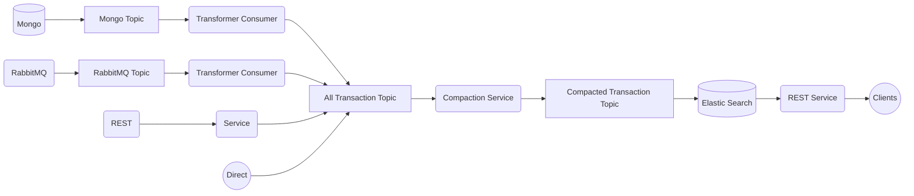
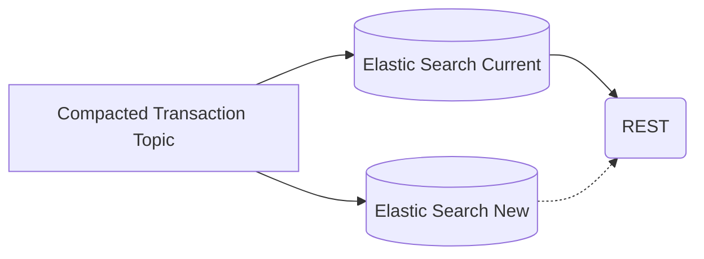

## Passbook
Our goal was to reduce the cost of the Elastic cluster and improve performance.

### Team Size and Roles
I led a team of 4 members. My responsibilities included designing the architecture, developing core components, and mentoring new team members.

### Situation
Every month, our transaction volume was increasing by 30%. Despite increasing spending, we struggled to scale efficiently. Initially, we managed 200GB of uncompressed JSON data, spending $14,000 monthly on the Elastic cluster. Response times were slow (400ms) and throughput was low, with no ability to update data.

### Task
Our main focus was on scaling the Elastic cluster dynamically according to demand. At month-end, our load peaked at 200,000 transactions per minute. We needed to optimize storage space and cleanup processes.

### Action

#### Data Consolidation
Previously, data was stored in daily indices, which was inefficient for searching across date ranges and updating data. We optimized this by maintaining a single 'transactions' index with two replicas for data redundancy. Each operation was routed based on a hash key (user ID) to ensure all operations for a user were handled by the same server, reducing query times.

#### Database Migration
We planned and executed a migration strategy (E) from ElasticSearch to OpenSearch. This ensured data integrity and zero downtime through live data replication and failover mechanisms (G). We used dual writes via Kafka to ensure updates were consistent across databases before switching over.

#### Compaction
To reduce Elastic updates, we batched updates through a compaction process, which managed data ingestion from multiple sources and removed out-of-order situations.

#### Out-of-order Situation
We used Kafka with a key as user id to eliminate out-of-order data issues.

### Result

We achieved a significant improvement in response time, reducing it from 400ms to 20ms. Through load testing, we increased throughput tenfold with the new architecture. Moreover, we reduced monthly costs by $10,000, from $14,000 to $4,000. Updates to ElasticSearch were drastically reduced, and we successfully executed a zero-downtime migration without data loss.
