## Project Overview
The project aimed to optimize billing processes. Previously, individual user data was processed using cron jobs, and timely billing was crucial to avoid Non-performing loans.

### Team Size and Roles
I led a team of 6 members responsible for planning, executing, and managing the billing department.

### Situation
Despite its financial importance, the billing team had been neglected. After analyzing the billing structure, we considered using Spark jobs, but due to the complexity of our microservices, orchestration emerged as the preferred approach.

### Task
Our goal was to understand the entire billing flow and rewrite it using orchestration techniques.

### Action

```mermaid
flowchart LR
    C(Cron 🕒)

    U_K[Users Kafka Topic]
    PB(Passbook Elastic)
    MONGO(Collect Mongo Data)

    LOAN(Loan)
    V(Validation)

    SMS
    PDF(PDF Generation)
    EMAIL(Email)
    WHATSAPP(WhatsApp)

    BLOCK[Block Duplicate Repayments]

    C-->U_K-->BLOCK-->PB-->MONGO-->LOAN-->V

    V-->SMS
    V-->PDF-->EMAIL
    PDF-->WHATSAPP
```

#### Retires
We ensured proper error handling with separate topics and controlled retries. If any part of the sequential flow failed, we halted the process at that point.

#### Prevent duplicate repayments
Duplicate repayments were a significant issue in our distributed system. We implemented measures to minimize duplicates without disrupting the user experience. Repayments were a top priority, so we avoided blocking user repayments during billing. Excess repayments were handled using a saga architecture for refunds.

#### Optimise PDF generation
PDF generation posed a challenge due to its compute-intensive nature. Our PDFs mirrored the website's appearance, requiring us to generate them from a headless browser. To optimize costs and complexity, we implemented a solution where we reused multiple browser tabs instead of opening and closing them repeatedly.

### Result
Our efforts reduced billing time from 10 hours to 2 hours for 3 million users. We successfully decreased duplicate repayment issues from three digits to single digits.
