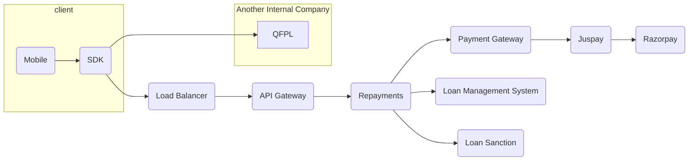

## Project Overview

Due to new RBI guidelines, we had to change our business model from cards to loans.

### Team Size and Roles

I served as the interim EM of a team of 14 members including developers, QA, Android, and iOS developers for the Repayments Team. My responsibilities included designing the architecture, developing core components, and mentoring new team members. Additionally, I managed the team, overseeing sprint planning, daily standups, weekly reports, OKRs, and KPIs.

I led the planning and execution for the Repayments team.

### Situation

Our entire business was built around card transactions. Due to regulatory requirements, we needed to completely transition to a loan-based model. The challenge was to divide the company into separate entities where each couldn't share data with the others. This separation included user data, loan data, and card transaction data.

The company was divided into three entities: QFPL, GIPL, and IGPL. Each entity had its own employees, salary structure, and compliance obligations. QFPL could store loan data but not user data, while GIPL could store user data but not other types. IGPL operated as a completely separate entity.

### Task

Plan the entire data movement process to ensure compliance.

### Action

#### Orchestrator
Repayments acted as the orchestrator between the Payment Gateway, Loan Sanction, and Loan Management System. Since internal data access was restricted, the approach involved front-end components fetching data separately from different services and combining them.

#### Backend-controlled UI Architecture

To reduce mobile client updates, we adopted an architecture where front-end components were reused, with the backend determining how the front-end should appear. This minimized frontend updates and kept the business logic centralized.

### Result

We successfully mitigated business risks and achieved our target of processing loans worth 800 crores in a month, down from 2200 crores in card transactions. This transition was a significant success.
