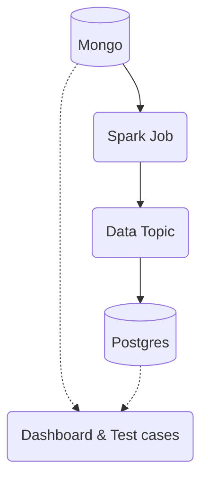

## Project Overview
**Goal:** Migrate from MongoDB to Postgres.

### Team Size and Roles
The team consists of 2 members, with myself leading the execution and timing.

### Situation
MongoDB Atlas is expensive and has a slow response time (6 hours). In contrast, AWS Aurora offers faster support (5 minutes) at a similar cost. Managing MongoDB's data structure has become complex. Changes to the schema require updates for the analytics team. Additionally, the shared MongoDB cluster affects other services if usage increases.

### Task

#### Old to New
Previously, we maintained two solutions for old and new repayments, which caused issues in API development, especially with pagination and data structure maintenance. The first task is to refactor the code and migrate old collections to new ones.

#### Test cases
There aren't enough test cases to ensure flawless execution. Therefore, we plan to keep the schema similar to the old one and test the repository layer thoroughly.

#### Dual writes
Our approach avoids dual writes to reduce complexity and ensure a straightforward testing strategy. Focus will be on drilling down and testing. Timing and planning are critical due to extensive changes in the codebase. The migration must be real-time with zero downtime.

### Action

#### Sequence of Actions
1. **Data Migration:** Begin transferring bulk data from MongoDB to Postgres. Merge transaction logs from the start of bulk data movement to achieve near real-time synchronization.
   
2. **Downtime Initiation:** Stop write access to MongoDB. Initiate downtime.

3. **Sync and Validation:** Wait for 100% synchronization and perform comprehensive checks.

4. **Switch to Postgres:** Enable write access on Postgres and perform the switchover.

### Result
The migration was successfully completed without any data corruption or loss.
